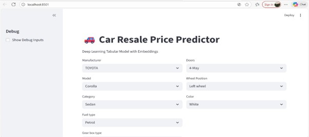
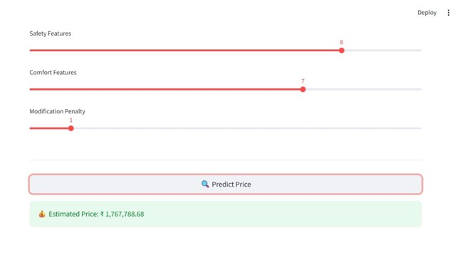
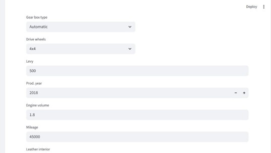
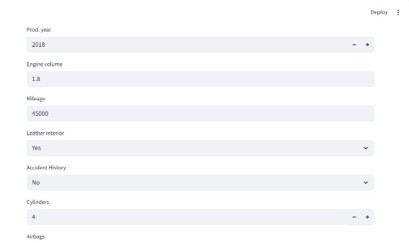
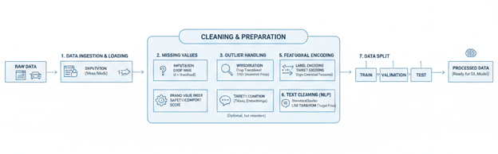
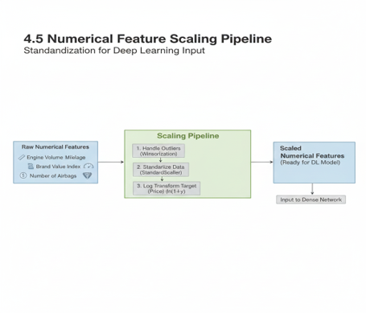

# 🚗 Car Price Prediction Using CNN-BiLSTM Hybrid Deep Learning Model


---

## 📌 Project Overview

This project presents a **Deep Learning-Based Used Car Price Prediction System** that estimates the market value of a vehicle using various attributes such as manufacturer, model, production year, mileage, engine volume, fuel type, accident history, and engineered features.

The system utilizes a **CNN-BiLSTM Hybrid Deep Learning Architecture** to capture complex relationships among vehicle attributes and generate accurate price predictions. An interactive **Streamlit Web Application** is integrated to provide real-time predictions through a user-friendly interface.

---

## 🎯 Objectives

- Predict used car prices with high accuracy.
- Apply feature engineering techniques to improve prediction performance.
- Compare deep learning models with traditional machine learning approaches.
- Provide a simple and interactive web-based prediction system.
- Assist buyers, sellers, and dealerships in making informed pricing decisions.

---

## 🛠️ Technologies Used

### Programming Language
- Python

### Libraries & Frameworks
- TensorFlow
- Keras
- Pandas
- NumPy
- Scikit-learn
- Streamlit
- Matplotlib
- Pickle

### Development Tools
- Jupyter Notebook
- VS Code
- Anaconda

---

## 📂 Project Structure

```text
Car-Prediction-System/
│
├── assets/
│   ├── homepage.jpg
│   ├── Result.jpg
│   ├── sample details.jpg
│   ├── sample details2.jpg
│   ├── pipeline.png
│   └── workflow.png
│
├── data/
│
├── model/
│
├── model_improved/
│
├── model_tabular/
│
├── app.py
├── app1.py
├── model_training.ipynb
├── Untitled.ipynb
├── requirements.txt
└── README.md
```

---

## 📊 Dataset Features

The model uses multiple vehicle attributes including:

- Manufacturer
- Model
- Production Year
- Category
- Fuel Type
- Engine Volume
- Mileage
- Gear Box Type
- Drive Wheels
- Doors
- Wheel Position
- Color
- Airbags
- Accident History
- Brand Value Index
- Safety Features Score
- Comfort Features Score
- Modification Penalty

---

## ⚙️ Data Preprocessing

The following preprocessing techniques are applied:

- Missing Value Handling
- Data Cleaning
- Label Encoding
- Feature Scaling using StandardScaler
- Feature Engineering
- Train-Test Splitting
- Input Reshaping for Deep Learning

---

## 🧠 Deep Learning Architecture

### CNN-BiLSTM Hybrid Model

The proposed model combines:

### 🔹 CNN Layer
- Extracts meaningful feature patterns.
- Learns local relationships among vehicle attributes.
- Reduces feature noise.

### 🔹 BiLSTM Layer
- Captures bidirectional dependencies.
- Improves contextual understanding of features.
- Enhances prediction performance.

### 🔹 Dense Layers
- Perform final regression.
- Generate accurate price predictions.

---

## 🔄 Model Architecture

```text
Input Features
      │
      ▼
   Conv1D
      │
      ▼
 MaxPooling1D
      │
      ▼
   BiLSTM
      │
      ▼
   Dense Layer
      │
      ▼
 Price Prediction
```

---

## 📈 Model Evaluation

The model performance is evaluated using:

- Mean Absolute Error (MAE)
- Mean Squared Error (MSE)
- Root Mean Squared Error (RMSE)
- R² Score

### Comparison Models

The CNN-BiLSTM model is compared against:

- Linear Regression
- Decision Tree Regressor
- Random Forest Regressor
- XGBoost Regressor

The hybrid model demonstrates improved prediction accuracy and better generalization performance.

---

## 🌐 Streamlit Web Application

The project includes an interactive Streamlit-based web application.

### Features

✔ Real-Time Price Prediction  
✔ User-Friendly Interface  
✔ Automated Data Preprocessing  
✔ Instant Prediction Results  
✔ Input Validation  
✔ Error Handling  

---

## 🚀 Installation

### Clone the Repository

```bash
git clone https://github.com/mohammedifteqhar/Car-Prediction-System.git
cd Car-Prediction-System
```

### Install Dependencies

```bash
pip install -r requirements.txt
```

### Train the Model

```bash
jupyter notebook
```

Open:

```text
model_training.ipynb
```

Run all cells.

### Launch the Application

```bash
streamlit run app.py
```

---

## 📸 Application Screenshots

### Home Page



### Prediction Result



### Sample Input Details



### Additional Sample Input



### Project Workflow



### Data Processing Pipeline



---

## 📋 Sample Workflow

1. Enter vehicle details.
2. Click **Predict Price**.
3. Input data is automatically preprocessed.
4. CNN-BiLSTM model predicts the car price.
5. Predicted market value is displayed instantly.

---

## 🔮 Future Enhancements

- Integration with live automobile marketplaces
- Mobile application support
- Car image-based price estimation
- NLP analysis of vehicle descriptions
- Cloud deployment
- Explainable AI (XAI)
- Real-time market trend analysis

---

## 💡 Key Learning Outcomes

- Deep Learning Model Development
- CNN Architecture
- Bidirectional LSTM Networks
- Feature Engineering
- Data Preprocessing
- Model Evaluation
- Streamlit Deployment
- Machine Learning Workflow

---

## 👨‍💻 Author

### Mohammed Ifteqhar

Bachelor of Engineering (Computer Science & Engineering)

**Areas of Interest**

- Deep Learning
- Machine Learning
- Data Science
- Artificial Intelligence

### Connect With Me

- GitHub: https://github.com/mohammedifteqhar
- LinkedIn: www.linkedin.com/in/md-ifteqhar-791227340

---

## 📜 License

This project is developed for educational and research purposes.

---

⭐ If you found this project useful, consider giving it a star on GitHub.
